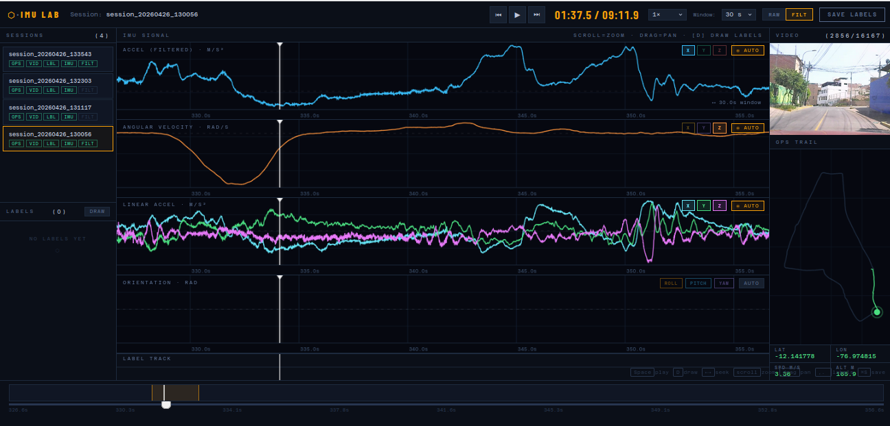

# ⬡ IMU Lab - IMU Data Playback & Labeling Tool

A powerful web-based visualization and labeling tool for Inertial Measurement Unit (IMU) data, featuring synchronized multi-axis signal charts, GPS trail visualization, video frame playback, and an intuitive labeling system for driving event annotation.



## 🎯 Overview

IMU Lab is a browser-based tool designed for exploring, visualizing, and annotating IMU sensor data from vehicle telemetry recordings. It provides a rich interface for analyzing accelerometer, gyroscope, and filtered orientation data alongside GPS trajectories and synchronized video frames, making it ideal for autonomous driving data analysis and driving event labeling.

## ✨ Features

### 📊 Multi-Channel Signal Visualization
- **4 Independent Chart Panels**: Accelerometer, Gyroscope, Linear Acceleration, and Orientation
- **Individual channel toggles**: Show/hide X, Y, Z or Roll, Pitch, Yaw independently
- **Interactive zooming**: Mouse wheel to zoom in/out of time windows
- **Pan navigation**: Click and drag to pan through time ranges
- **Auto-scaling**: Toggle between global and window-based Y-axis scaling
- **Time cursors**: Precise timestamp tracking across all charts
- **Label overlay bands**: Visual representation of labeled events on signal charts

### 🏷️ Labeling System
- **Drag-to-label**: Click and drag across any chart to create time-range labels
- **Quick label templates**: Predefined labels for common events (sharp turn, harsh braking, etc.)
- **Label track visualization**: Timeline view showing all labeled events
- **Label navigation**: Jump between labels with keyboard shortcuts
- **Export/Import**: Save and load labels as JSON via API
- **Color-coded labels**: Automatic color assignment for different event types

### 🗺️ GPS Trail Visualization
- **Real-time GPS path**: Green trail showing traveled path
- **Live position indicator**: Current position marker on GPS map
- **GPS data display**: Latitude, longitude, speed, and altitude readouts
- **Split visualization**: Past path (green) vs future path (dimmed)

### 🎬 Video Frame Playback
- **Synchronized frames**: Video frames aligned with IMU timestamps
- **Frame-accurate seeking**: Precise frame display based on current time position
- **Multiple format support**: PNG/JPG frame sequences

### 🎮 Playback Controls
- **Play/Pause**: Smooth playback with configurable speed (0.25x to 4x)
- **Scrubber**: Timeline scrubber for quick navigation
- **Minimap**: Overview of entire session with window indicator
- **Auto-follow mode**: Automatically follows playback cursor
- **Zoom presets**: Quick zoom levels (3s, 5s, 10s, 20s, 30s, 60s, All)

### 🎨 Rich UI/UX
- **Dark theme**: Eye-friendly dark interface designed for extended use
- **Keyboard shortcuts**: Comprehensive keyboard navigation
- **Session browser**: List of available recording sessions
- **Responsive layout**: Adapts to different screen sizes
- **Tooltips and hints**: Contextual help throughout the interface

## ⌨️ Keyboard Shortcuts

### Playback
| Key | Action |
|-----|--------|
| `Space` | Play/Pause |
| `←` `→` | Seek backward/forward 500ms |
| `F` | Toggle auto-follow mode |
| `,` `.` | Jump to previous/next label |
| `+` `-` | Zoom in/out |

### Channel Toggles
| Chart | Channel 0 | Channel 1 | Channel 2 |
|-------|-----------|-----------|-----------|
| **Accelerometer** | `Q` (X) | `W` (Y) | `E` (Z) |
| **Gyroscope** | `A` (X) | `S` (Y) | `D` (Z) |
| **Linear Accel** | `Z` (X) | `X` (Y) | `C` (Z) |
| **Orientation** | `R` (Roll) | `T` (Pitch) | `Y` (Yaw) |

### Tools
| Key | Action |
|-----|--------|
| `D` | Toggle draw/label mode |
| `⌘/Ctrl + S` | Save labels |
| `⌘/Ctrl + 1-4` | Toggle autoscale for charts 1-4 |
| `Esc` | Close label popup |

### Mouse Controls
| Action | Function |
|--------|----------|
| **Scroll** | Zoom in/out at cursor position |
| **Click + Drag** | Pan (normal mode) or Create label (draw mode) |
| **Click** | Seek to position |
| **Minimap Click** | Jump to position |

## 📁 Data Format

### Expected File Structure
```
data/
└── sessions/
    └── [session_id]/
        ├── imu.csv # Raw IMU data
        ├── filtered_imu.csv # Filtered IMU data (optional)
        ├── gps.csv # GPS trajectory data (optional)
        ├── frame_timestamps.csv # Video frame index (optional)
        └── frames/ # Video frame images (optional)
            ├── 000001.png
            ├── 000002.png
            └── ...
```

### IMU CSV Format
```csv
timestamp_ms,accel_x,accel_y,accel_z,gyro_x,gyro_y,gyro_z
0.0,0.12,-9.81,0.34,0.001,-0.002,0.000
10.0,0.15,-9.78,0.31,0.002,-0.001,0.001
...

t,gx,gy,gz,ax,ay,az,alin_x,alin_y,alin_z,roll,pitch,yaw
0.0,0.001,-0.002,0.000,0.12,-9.81,0.34,0.10,-0.15,0.20,0.01,0.05,-0.02
...

timestamp_ms,latitude,longitude,speed_mps,altitude_m
0.0,37.7749,-122.4194,15.2,10.5
...

frame_idx,timestamp_ms
1,0.0
2,33.3
...